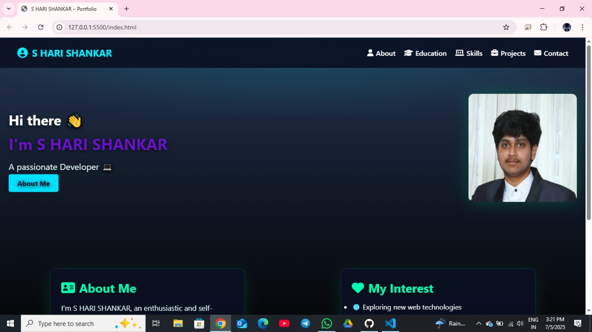
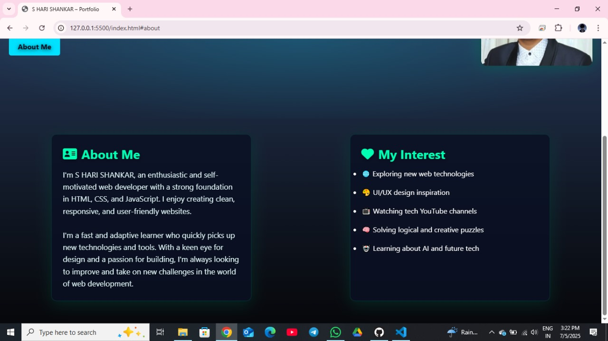
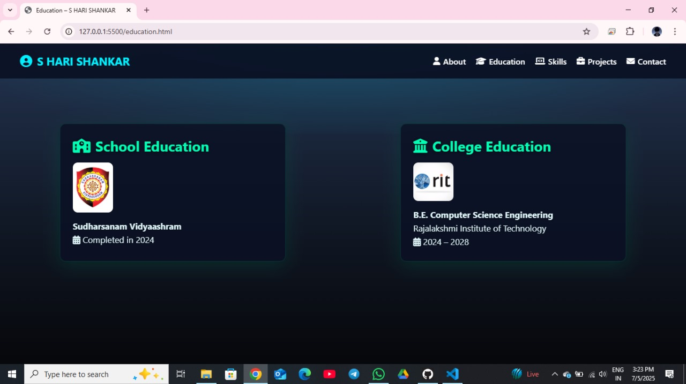
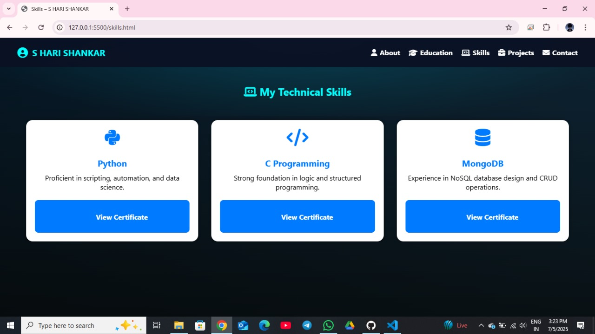
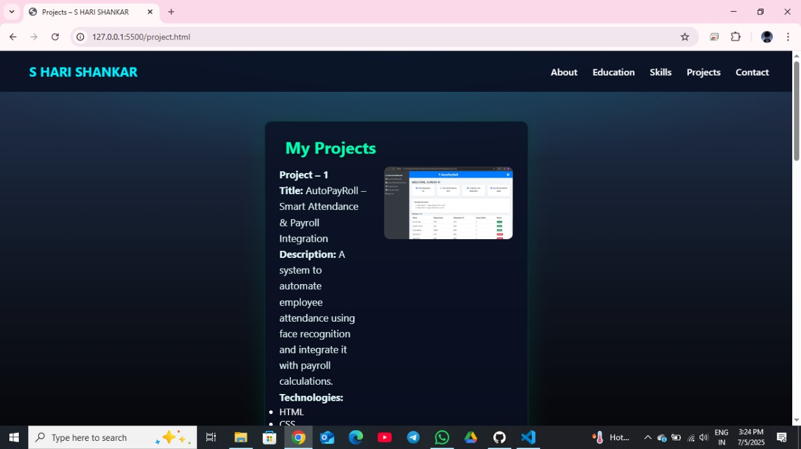
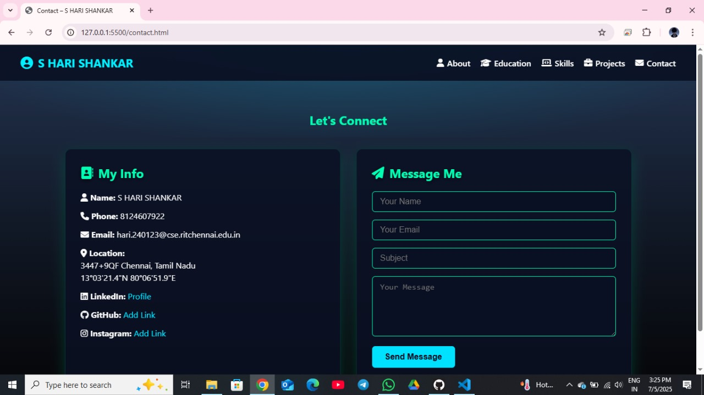

#STATIC WEBSITE FOR PORTFOLIO

*COMPANY* : CODETECH IT SOLUTIONS

*NAME* : S HARI SHANKAR

*INTERN ID* : CT04DH297

*DOMAIN* : SOFTWARE DEVELOPMENT

*DURATION* : 4 WEEKS

*MENTOR* : NEELA SANTHOSH

This is my personal portfolio website built as part of my internship at CODTECH IT SOLUTIONS. It showcases my skills, projects, education, and contact information in a clean, responsive, and stylish layout.

## 🔗 Live Demo

🌐 View the live website here:  
👉 https://harimadav.github.io/portfolio/

 📁 Sections Included

- 🧑‍💻 About Me  
- 🚀 My Interests  
- 🛠 Skills & Certificates  
- 📚 Education  
- 💼 Projects  
- 📞 Contact Me

🛠 Technologies Used

- HTML5  
- CSS3  
- JavaScript

## 📸 Screenshots

### 🏠 Home Page

### 👤 About Me

### 🎓 Education

### 🛠 Skills

### 📁 Projects

### 📞 Contact

📬 Contact

S HARI SHANKAR  
📧 hari.240123@cse.ritchennai.edu.in  
📱 +91 8124607922  
📍 Chennai, Tamil Nadu  
🔗 [LinkedIn](https://www.linkedin.com/in/s-hari-shankar-27279732b)

